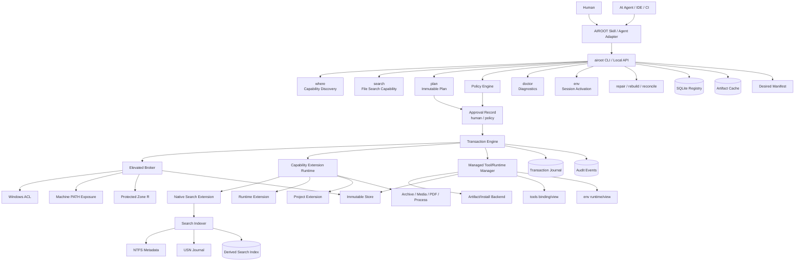

# AIROOT 总体方案规划 v0.3

> 文档状态：方案冻结候选
>
> 文档性质：架构规划、协议草案和实现前验收基线
>
> 当前范围：Windows 主平台；不包含生产实现，不修改当前机器环境

## 1. 文档目的

本文将 AIROOT 的定位、边界、架构、协议、状态、权限、事务、能力扩展、搜索机制、CLI、Skill 和实施路线整理为一份统一规划，作为后续设计评审和实现前的基线。

本文解决的核心问题不是“把所有软件安装进来”，而是：

> 如何让 AI Agent 在长期使用的 Windows 电脑上，以确定、可审计、可诊断、可恢复的方式获得本机能力。

本文必须区分两个经常被简称为“工具”的对象域：

1. **Capability Extension（能力扩展）**：实现 `file_search`、`archive` 等 AIROOT 能力的模块，负责能力协议和运行行为；
2. **Managed Tool / Runtime Instance（受控工具/运行时实例）**：AIROOT 明确纳入生命周期管理的具体 payload、版本、架构、manifest、健康状态、binding、暴露入口和回滚记录，例如 `jq.exe`、`ffmpeg.exe`、Python、Node。

因此，能力扩展不是待维护软件清单，但 AIROOT 仍然可以并且需要维护明确声明的 managed tool/runtime。Everything、`rg`、7-Zip、ffprobe 等机器上已有的软件默认是外部软件或 `external_reference`；只有显式 `import`、`recreate` 或受支持的安装计划成功后，才会生成新的 managed instance。搜索发现本身不会自动取得生命周期所有权。

### 1.1 规范层级、术语和解释规则

本文档组采用以下规范层级：

1. 已发布的 JSON Schema 和 SQLite migration 是机器可执行的最终契约；
2. `AIROOT-v0.3-三大核心契约方案.md` 约束权限、批准、状态事实和事务恢复；
3. 本文约束目录、对象模型、CLI、Skill 边界和整体生命周期；
4. `AIROOT-搜索能力与工具集成协议方案.md` 是 `file_search` 和 Extension profile 的专用约束；
5. `AIROOT-v0.3-验证与测试方案.md` 只定义验收证据，不改变运行时语义。

文中使用以下含义：`必须` 是实现和测试都要满足的规范要求，`应该` 是默认行为（有理由时必须记录偏离），`可以` 是兼容性或实现选择。示例 JSON 只在明确标注“规范示例”时具有字段要求，其他代码块只是说明。

术语固定如下：

| 术语 | 定义 | 允许的上下文 |
|---|---|---|
| `capability_id` | 对 Agent 暴露的稳定能力，例如 `file_search`、`python` | CLI、Skill、where、binding |
| `extension_id` | 提供能力协议的模块身份 | Extension manifest、调用 envelope |
| `implementation_id` | 某个 capability 在一个 binding key 下的具体实现身份 | active binding、selection、切换审计 |
| `install_backend_id` | 获取、验证、stage、commit 受控实例的后端 | plan/install/transaction；不是能力入口 |
| `tool_id` | 受控工具的稳定逻辑名称，例如 `jq`、`ffmpeg` | tool、where、manifest |
| `instance_id` | 不可变的版本/平台/架构对象身份 | registry、binding、rollback |
| `managed_tool_instance` | AIROOT 拥有生命周期的具体工具 payload 和 manifest | install、verify、retire、gc |
| `runtime_instance` | Python、Node 等受控运行时对象 | env、runtime、binding |
| `external_reference` | 指向 AIROOT 外部对象的只读引用，不代表生命周期所有权 | discover/where/inventory |

`provider` 不再作为泛称。只有在引用旧协议、具体 Install Backend 或明确的兼容适配器时才使用该词；新的字段必须使用 `install_backend_id`、`extension_id` 或 `implementation_id`。

路径序列化也必须固定：registry 内部保存 root-relative、canonical、大小写不敏感比较后的路径，并同时保存 root identity；`where` 和 `search` 的 JSON 默认返回当前 root 解析后的绝对 canonical path，只有显式 `--relative-root` 才返回相对路径。任何路径字段都不得通过字符串拼接绕过 root、reparse point 或 volume identity 校验。

## 2. 产品定义

### 2.1 一句话定义

**AIROOT 是面向 AI Agent 的本机能力控制平面。**

它位于：

```text
AI Agent / IDE / CI / Human
             ↓
       AIROOT Skill / CLI
             ↓
  Windows / Filesystem / Runtime / Project
```

AIROOT 统一管理：

```text
Capability
Scope
State
Policy
Extension
Transaction
Verification
Recovery
```

### 2.2 解决的问题

AI Agent 在本机工作时经常遇到：

- 不知道某个能力是否存在；
- 不知道找到的可执行文件是否可信；
- PATH 被多个工具和安装器污染；
- 当前终端和新终端看到的环境不同；
- 运行时版本不满足项目要求；
- 工具存在但已损坏；
- 安装过程被中断，留下半成品；
- 多个 Agent 并发修改同一环境；
- 项目声明和机器状态不一致；
- 机器上有外部软件，但没有稳定的能力接口；
- 发生故障后只能重新安装，无法解释和恢复。

AIROOT 的目标是把这些问题转化为稳定的本机 API：

```text
where
doctor
plan
approve
install
search
env
repair
rebuild
reconcile
```

### 2.3 不是什么

AIROOT 不是：

- 通用包管理器；
- 无边界的外部软件维护平台；AIROOT 只管理显式纳入的 managed tool/runtime；
- 自动安装所有软件的脚本；
- 容器、虚拟机或沙箱；
- 企业级软件分发系统；
- 试图接管整台电脑所有软件的系统；
- 用 Skill 规则代替 Windows ACL 的安全系统；
- 对抗已经拥有管理员权限的恶意进程的安全产品。

**"不是安全产品"这一条是定位，不是欠债。** AIROOT 面向**家用主机**上的单用户场景，它提供的是
**确定、可审计、可诊断、可恢复**的能力管理；**"是否可信、是否放行、要不要在执行前拦一下"属于使用 AIROOT 的
那一层的职责**——例如 DeepSeek Harness 这类上游 harness，它有自己的确认、审批与沙箱策略。AIROOT 交出的是
**可核对的账**（state、journal、audit、diagnostic 与验证语料），不是** enforceable 的边界**。

这条归属决定了几件事，它们是设计而不是缺陷：

* `security_mode=policy_only` + `enforcement=same_user_can_bypass` 是这个 build 的**正确永久自述**，
  不是"还没实现受保护模式"的临时标记；
* 同用户进程能绕过 AIROOT 的任何限制，**这是已知且接受的**——所以 AIROOT 不把任何机制建立在
  "调用方被挡住了"之上；
* 需要提权或受保护服务才能成立的能力（受保护 broker、ACL 强制、machine 级写入、真实批准签发方）
  **不在本项目的必做范围内**，见路线图 P2 与 P9 的处置。

## 3. 核心原则

### 3.1 能力优先，不以软件名称为中心

Agent 调用能力：

```text
file_search
content_search
archive
media_probe
pdf_extract
process_inspect
runtime
environment
project
```

Agent 不应该被迫知道底层是 Everything、`rg`、7-Zip 还是其他软件。

### 3.2 同一类型一个默认实现

对于同一个 binding key（包含 root/machine、project/session identity、平台、scope 和 capability）：

```text
(root_instance_id, machine_id, identity?, platform, scope, capability_id)
```

AIROOT 只绑定一个 active implementation。

例如：

```text
(windows, machine, file_search)
    → airoot-native-search-native-index
```

机器上可以存在其他同类软件，但它们不是 AIROOT 默认能力入口，也不自动进入 AIROOT 的维护范围。

“一个 active”按 binding key 定义，而不是整台机器只有一个实例：

```text
machine:  (machine_id, platform, capability_id, machine)
session:  (machine_id, session_id, capability_id, session)
project:  (machine_id, project_id, capability_id, project)
```

因此多个项目和多个 session 可以分别绑定不同实例；每个 key 仍然只能有一个 active binding。**健康的 managed binding 与健康的 external reference 是并列的一等候选**，机器级两者的先后由 policy 决定，默认 reference 优先（steward-first，ADR-0006）。owned binding 损坏时不再报告冲突，而是**正常降级**到健康的 reference（`CURRENT_SOURCE_DEGRADED`），并把两者证据都留在响应里；只有确实无可用候选时才报 `BROKEN`。

### 3.3 策略约束和操作系统强制分开

Skill 和 CLI 可以约束遵守 AIROOT 协议的 Agent，但同一用户身份的进程理论上可以直接修改自己的 HKCU、用户目录和用户进程环境。

因此明确区分：

```text
Protected machine mode
  Windows ACL + elevated broker + protected R

User compatibility mode
  policy + audit + convention
```

不能把 User PATH 约定描述成同用户不可绕过的安全边界。

### 3.4 registry 不是磁盘事实

registry 是 declared state 的权威来源，磁盘和 OS 是 physical state 的事实来源。

```text
desired      应该有什么
declared     AIROOT 声明有什么
physical     磁盘实际有什么
effective    当前进程实际能用什么
historical   之前发生过什么
```

### 3.5 不可变对象优先

版本对象安装后不直接覆盖：

```text
store/python/cpython/3.11.9/win-x64
store/python/cpython/3.12.7/win-x64
```

通过 binding、stable launcher 和 generation 切换 active instance。

### 3.6 失败可解释，恢复不猜测

`doctor`、`repair` 和 `rebuild` 必须给出证据和 reason code。发现陌生对象时默认报告为 unmanaged 或 quarantine，不自动接管。

## 4. 总体架构



### 4.1 组件职责

| 组件 | 责任 | 不负责 |
|---|---|---|
| Skill/Agent Adapter | 自然语言理解、调用编排、结果解释 | 写 R、改 registry、直接安装外部软件 |
| CLI/Local API | 稳定命令、JSON、退出码、状态查询 | 代替 Windows ACL |
| Policy Engine | 计算允许、拒绝、需要批准 | 假装提供 OS 级隔离 |
| Registry | 保存 declared state、binding、generation、审计索引 | 证明磁盘一定正确 |
| Transaction Engine | plan、锁、journal、提交、恢复 | 让不可逆第三方脚本变成原子操作 |
| Elevated Broker | 写 R、写 machine PATH、执行受保护提交 | 解释自然语言 |
| Capability Extension | 扩展 AIROOT 的某项能力，声明能力操作和健康检查 | 管理工具 payload 的安装、升级、回滚和 GC |
| Managed Tool/Runtime Manager | 管理 tool/runtime instance、manifest、binding、verify、retire 和 GC | 实现具体能力操作或接管未声明的外部软件 |
| Install Backend | fetch、verify、stage、commit、rollback 一个受控实例 | 直接成为 Agent 的能力入口或自行改变 active binding |
| Search Indexer | 建立和维护文件搜索派生索引 | 证明文件属于 managed capability |
| Doctor | 诊断不变量、差异和修复建议 | 擅自删除陌生对象 |

## 5. 能力模型

### 5.1 Capability

Capability 是 AIROOT 对外稳定暴露的逻辑能力。

```text
file_search
content_search
archive
media_probe
pdf_extract
process_inspect
runtime
environment
project
```

Capability 不等同于一个可执行文件。

### 5.2 Extension

Extension 是实现 capability 的 AIROOT 模块，可以包含：

- CLI 子命令；
- 本地库；
- 后台进程；
- 输入输出 schema；
- 健康检查；
- 权限声明；
- 超时和取消；
- 与 registry 的 binding；
- 测试夹具和模拟实现。

Extension 不默认包含：

- 外部软件安装包；
- 外部软件自动升级；
- 外部软件卸载器；
- 多个同类软件的维护清单；
- 把外部工具的私有参数直接暴露给 Agent。

### 5.3 Implementation Instance

Implementation Instance 是某个 capability 在一个 binding key 下可被选择的具体实现。它回答“由哪个 Extension/implementation 提供能力”，不表示该 Extension 的二进制 payload 由谁维护：

    capability_id
    extension_id
    implementation_id
    version
    platform
    architecture
    health

### 5.4 Managed Tool Instance

Managed Tool Instance 是 AIROOT 实际拥有生命周期的具体工具对象，例如 `jq-1.7.1-win-x64` 或 `ffmpeg-7.x-win-x64`。它回答“AIROOT 管理哪一份可执行 payload”，并至少包含：

    tool_id
    instance_id
    version
    platform
    architecture
    artifact_digest
    install_backend_id
    store_path
    file_manifest_digest
    lifecycle_status
    health

`store` 保存不可变 payload；`tools` 保存面向用户的 binding/view、manifest 摘要、版本选择和 entrypoint metadata；`exposure` 保存稳定 launcher。三者加上 registry instance row 才构成一个完整的 managed tool：

    managed tool = registry instance
                 + store payload
                 + tools binding/view
                 + exposure launcher

Managed Tool 生命周期固定为：

    discovered
      -> external_reference | unmanaged
      -> (explicit import/recreate/adopt plan)
      -> planned
      -> staged
      -> installed
      -> verified
      -> active
      -> healthy | degraded | broken
      -> retired
      -> garbage_collectable

`installed` 表示 payload 已进入 `store` 且 registry instance 仍为 inactive；`verified` 表示 manifest、digest、架构和 entrypoint probe 通过；`active` 只能由 `ACTIVE_BOUND` generation 产生；`retired` 不再被默认 `where` 选择；只有无 binding、无 rollback 保留和无 transaction 引用的对象才能进入 `garbage_collectable`。`doctor` 不自动执行 GC。

Capability Extension、Managed Tool Instance、External Reference 和 Install Backend 必须保持分离：

    Capability Extension  -> 定义能力如何调用
    Managed Tool Instance -> 定义哪份 payload 由 AIROOT 维护
    External Reference    -> 只记录外部对象，不拥有其生命周期
    Install Backend       -> 定义如何获取和提交 managed instance

示例：

| 对象 | 例子 | AIROOT 的责任 |
|---|---|---|
| Capability | `archive` | 维护能力契约和行为 |
| Extension | `airoot-archive-extension` | 维护模块版本、manifest 和健康检查 |
| Managed Tool | `jq-1.7.1-win-x64` | 维护 payload、digest、binding、暴露、回滚和 GC 条件 |
| Managed Runtime | `python-3.12.7-win-x64` | 维护 runtime、launcher、依赖和环境 binding |
| External Reference | `C:\Tools\jq.exe` | 只维护引用状态和漂移证据 |
| External Software | Everything | 默认不纳入生命周期管理 |
| Install Backend | `portable_archive` | 维护 fetch/verify/stage/commit/rollback 契约 |

用户说“安装 jq”时，`capability_id=jq` 是稳定能力名，`tool_id=jq` 是受控工具逻辑名，具体版本生成新的 `instance_id`，并由 `portable_archive` 创建、验证和提交。用户说“查找文件”时，调用的是 `file_search` capability，由 Search Extension 提供；搜索找到 `jq.exe` 不会自动创建 managed instance。
### 5.5 Binding

Binding 描述 instance 如何被暴露：

```text
machine
session
project
```

同一 capability 可以有不同 scope 的 binding，但同一 scope 的默认 active binding 只有一个。

### 5.6 Environment

Environment 是可以被显式激活的执行上下文，例如：

```text
py311-torch
project-vllm
node-build-session
```

Environment 不等于 machine runtime，也不应该把所有环境变量永久写入系统。

### 5.7 Project

Project 是 capability 的消费者和边界拥有者。

项目可以声明：

```yaml
runtime:
  python: ">=3.11,<3.13"
  node: "22"

capabilities:
  - file_search
  - media_probe
```

项目目录下的 `.venv`、`node_modules` 和缓存默认仍由项目自己负责。

## 6. 能力扩展目录

下面是 AIROOT 的能力方向，不是外部软件维护清单。

| Capability | CLI 入口 | v1 规划 | 示例 |
|---|---|---|---|
| `file_search` | `airoot search` | 首个核心 Extension | 查找文件名、路径、扩展名和元数据 |
| `content_search` | `airoot content search` | 后续 | 在允许的项目根中搜索文本内容 |
| `archive` | `airoot archive` | 后续 | 列出、解压、创建归档 |
| `media_probe` | `airoot media probe` | 后续 | 读取音视频格式、编码、时长 |
| `image_transform` | `airoot image` | 后续 | 调整尺寸、格式、元数据 |
| `pdf_extract` | `airoot pdf extract` | 后续 | 提取 PDF 文本和元数据 |
| `process_inspect` | `airoot process inspect` | 后续 | 查询进程、端口和文件占用 |
| `runtime` | `airoot runtime` | v1 Python/Node 方向 | 发现、安装、切换运行时 |
| `environment` | `airoot env` | v1 session 方向 | 激活 session/project 环境 |
| `project` | `airoot project` | 后续 | 读取项目声明、计算能力差异 |
| `diagnostics` | `airoot doctor` | v1 | 诊断状态和不变量 |
| `recovery` | `airoot repair` | v1 基础 | 修复、重建、回滚和对账 |

`diagnostics` 和 `recovery` 是 AIROOT Core 的控制平面服务，不参与“一个 capability 一个 active implementation”的 Extension binding 规则。`runtime`、`environment`、`file_search` 等才是由 Extension 提供的能力类型。

外部软件可以帮助实现某个 Extension，但不会自动成为 AIROOT 的能力接口。例如：

```text
Everything 的机制 → Native File Search Extension
rg 的搜索机制   → Content Search Extension 的参考
7-Zip 的格式支持 → Archive Extension 的参考
```

## 7. Zone 与 Scope

### 7.1 Zone

| Zone | 含义 | 典型内容 | 全局 PATH |
|---|---|---|---|
| R | 受信任机器能力 | immutable store、stable launcher | 可以通过 exposure |
| W | 用户可写执行上下文 | cache、session env、共享环境 | 不允许进入 machine PATH |
| P | 项目拥有空间 | `.venv`、`node_modules`、project cache | 只在 project/session 可见 |

W 不是绝对不可执行区，而是非全局执行区。

### 7.2 Scope

| Scope | 含义 | 示例 |
|---|---|---|
| machine | 跨项目可发现 | machine Python、Native Search |
| session | 当前终端或 Agent 会话 | cache 变量、激活的环境 |
| project | 单个项目 | `.venv`、项目 extension binding |
| system | 服务、驱动、系统级行为 | v1 默认不纳入普通安装 |

Zone 描述物理信任级别，Scope 描述可见范围。二者不能互相替代。

## 8. Windows 安全和权限模型

### 8.1 Skill 自包含目录布局

AIROOT 本身就是 Skill 目录，`AIROOT\SKILL.md` 是 Skill 入口；`AIROOT\cli\` 是 CLI 和运行数据的逻辑根目录：

```text
AIROOT\
  SKILL.md              Skill 入口和行为边界
  agents\               UI/调用元数据
  references\           Skill 的按需参考资料

  cli\
    schema\             registry、plan、extension、CLI schema
    app\                CLI Core、Extension Runtime、Skill adapter
    extensions\         AIROOT 能力扩展模块
    bin\                airoot CLI 和必要 launcher

    tools\              managed tool binding/view、manifest 和 entrypoint metadata；不存 payload
    env\                runtime/environment binding/view；不存 runtime payload
    store\              不可变对象和内容寻址对象
    exposure\           stable launcher、shim 和本地 API 入口
    state\              registry.db、generation、root marker
    tx\                 transaction journal 和 staging
    cache\              artifact cache，不参与全局发现
    logs\               诊断、索引和审计日志
    quarantine\         发现但未接管的对象证据
```

目录的物理语义固定如下：

    store       唯一的不可变 payload 存储
    tools       Managed Tool 的 binding/view、manifest 摘要、版本选择和入口元数据
    env         Runtime/Environment 的 binding/view；runtime payload 仍在 store
    exposure    受保护的稳定 launcher；active 由 registry binding 决定
    state       registry、generation、root identity 和事件权威来源
    cache       可重建下载物和搜索索引
    tx          staging、journal 和恢复证据

tools 和 env 是用户可理解的命名空间；import --target tools 或 recreate --target env 的结果是“store 新实例 + 对应 binding”，不是把外部目录直接拖进目标文件夹。

这里有两个生命周期层：

```text
AIROOT\SKILL.md、agents/、references/、cli/app/、cli/extensions/、cli/bin/、cli/schema/
    Skill/CLI 发布内容，可升级、可替换

AIROOT\cli\tools/、env/、store/、exposure/、state/、tx/、cache/、logs/
    AIROOT 运行数据和受控对象，必须保留、迁移和恢复
```

Skill 更新、重新安装或切换版本时，可以替换 `SKILL.md`、Skill metadata 和 `cli` 应用层，但不能删除或覆盖 `AIROOT\cli` 下的持久数据层。应用层和数据层的兼容关系通过 `protocol_version`、`schema_version` 和 migration 记录管理。

Skill 目录不是天然安全边界。Protected machine mode 仍然需要对 `tools`、`env`、`store`、`exposure` 和 `state` 设置明确 ACL；如果 Skill 位于用户可写目录，只能提供 User compatibility mode 的安全语义。

Protected machine mode 还有一个额外前提：Elevated Broker 不能信任普通用户可写的 Skill 代码。以下任一条件成立时，只能使用 User compatibility mode，或先执行受保护的 bootstrap：

- `AIROOT\cli\app`、`extensions` 或 `bin` 可被普通用户修改；
- Skill 位于普通用户可写目录，broker 会从该目录加载代码；
- Extension manifest、CLI binary 或 broker 版本无法通过 hash/签名校验；
- 应用层和数据层的 protocol/schema 版本不兼容。

`AIROOT\SKILL.md` 只提供模型行为说明，不是权限凭据，也不是 elevated broker 的可信代码来源。Protected machine mode 的可信根是受 ACL 保护的 broker、应用 manifest 和数据根。

根目录由 root marker 确认，而不是只依赖当前路径：

```json
{
  "root_instance_id": "...",
  "protocol_version": 1,
  "volume_serial": "...",
  "canonical_path": "...\\AIROOT\\cli",
  "created_at": "..."
}
```

root marker 丢失、volume serial 改变或路径越出根目录时，AIROOT 必须进入 `recovery_required`，不能直接接管新目录。

### 8.1.1 Skill 更新、复制和 root relocate

AIROOT 的 Skill 根路径变化不等于数据可以直接接管：

- 同一路径更新：先把新 `app`/`extensions` 放到临时目录，校验 protocol/schema 兼容，再原子切换；失败时保留旧应用层；
- Skill 复制到新路径：新路径先被视为未注册 root，只能读取 root marker 和 registry 摘要，不能直接激活原 binding；
- 同卷 relocate：复制或重命名数据后校验所有 manifest、SQLite integrity 和 root identity，再切换 active root；
- 跨卷 relocate：执行 copy + verify + switch，旧 root 在确认新 root 健康前保留为只读，不做原子 rename 的假设；
- root identity 不变但 canonical path 改变：记录一次 `root_relocated` event；
- volume serial 或 root marker 不匹配：进入 `recovery_required`，要求显式 `root adopt` 或恢复备份；
- Skill 卸载：只能卸载发布层，必须保留或明确导出 `state`、`store`、`tools`、`env` 和审计数据，不能隐式删除受控对象。

应用层更新包必须带 `release_id`、`protocol_version`、`schema_version`、文件 manifest、来源和签名。broker 只接受受信来源并在临时目录完成 hash/signature 校验；更新通过受保护的 generation pointer 原子切换，旧应用层保留到新版本通过 `probe`、`doctor` 和协议 smoke test 后才可回收。更新期间已运行的 CLI 继续使用旧 generation，broker 不允许新旧应用层同时提交同一 transaction；失败、取消、重启或协议不兼容都回退旧应用层并保留诊断事件。root relocate 使用同一套 copy/verify/switch 规则，不能把复制目录自动视为新 root。

### 8.2 ACL 基线

| 区域 | SYSTEM | Administrators | 普通 Users |
|---|---|---|---|
| `cli\app`、`extensions`、`bin` | Full | Full | Read/Execute |
| `store` | Full | Full | Read/Execute |
| `tools` | Full | Full | Read/Execute |
| `env\runtimes`（binding/view，无 payload） | Full | Full | Read/Execute |
| `env\contexts` | Full | Full | 受控读写，不参与 machine PATH |
| `exposure` | Full | Full | Read/Execute |
| `state\registry.db`、`state\root.json` | Full | Full | Read；只能由 broker 写 |
| `state\plans` | Full | Full | Create/Read；broker 验证后消费 |
| `tx` | Full | Full | Read；只能由 broker 写 |
| `cache`、`cache\search` | Full | Full | Read/Write，但不参与执行发现 |
| `logs\audit` | Full | Full | Read；只能由 broker 追加 |
| `logs\diagnostic` | Full | Full | Read/Write |
| `quarantine` | Full | Full | Read；写入需经过 discovery service |

`doctor` 必须检查 ACL 是否偏离。

“不参与执行发现”是 AIROOT 的解析规则，不是 Windows 禁止普通用户从 cache/W 手动启动程序。AIROOT 不会把这些路径加入 machine PATH、stable launcher 或默认 `where` 结果；如果用户显式提供绝对路径，执行责任由用户和调用方承担。

目录的物理语义固定如下：

```text
store       唯一的不可变 payload 存储
tools       tool capability 的 managed binding、manifest 和视图，不重复存放 payload
env         runtime/environment binding；runtimes 属于 R，contexts 属于受控 W
exposure    静态 launcher/shim；active instance 由 registry binding 决定
state       declared state 和 root identity
cache       可重建下载物和搜索索引
tx          staging、journal 和恢复证据
```

`tools` 和 `env` 是用户可理解的能力命名空间；真正的实例 payload 只进入 `store`。`import --target tools` 或 `recreate --target env` 的结果是“store 新实例 + 对应 binding”，不是把外部目录直接拖进目标文件夹。

### 8.3 PATH

机器 PATH 只管理一个入口：

```text
AIROOT\cli\exposure\bin
```

各版本目录不直接写入 PATH。stable launcher 根据 active binding 找到目标 instance。

### 8.4 执行主体

```text
airoot-cli       普通用户进程：where/doctor/plan/search
airoot-elevated  短时管理员 broker：写 R、machine PATH、提交受保护变更
human            UAC 或独立交互中的最终批准者
```

Extension 只能返回计划、artifact 和检查结果，不能直接取得 R 写权限。

### 8.5 批准模型

批准必须绑定 canonical plan：

```json
{
  "approval_id": "approval-...",
  "plan_hash": "sha256:...",
  "machine_id": "...",
  "root_instance_id": "...",
  "policy_revision": 7,
  "approval_mode": "human | policy",
  "issuer": "protected-approval-broker",
  "approved_by_sid": "S-1-...",
  "issued_at": "...",
  "expires_at": "...",
  "nonce": "...",
  "signature": "base64:..."
}
```

`agent request`、`human approval`、`policy approval` 必须在审计记录中区分。

低风险、无脚本、低副作用的动作可以由受保护 policy 自动批准。高风险动作必须进入人工批准。`airoot approve` 只消费由批准通道签发的 token，不生成批准；token 必须绑定完整 `plan_hash`、root、machine、policy revision 和一次性 `nonce`，由 broker 校验签名、有效期和 issuer，并在 SQLite 事务中原子标记 `consumed_at`。重复消费、撤销、policy revision 变化、计划内容变化或 cancellation 都必须拒绝提交并留下审计事件。

## 9. 五层状态模型

### 9.1 状态定义

| 状态 | 问题 | 来源 |
|---|---|---|
| Desired | 应该有什么 | 受信任 manifest、项目声明 |
| Declared | AIROOT 声明有什么 | SQLite registry |
| Physical | 物理上有什么 | 文件系统、ACL、注册表、版本探测 |
| Effective | 当前进程实际能发现什么 | PATH、session env、launcher |
| Historical | 之前做过什么 | transaction/event log |

### 9.2 差异关系

```text
desired    ↔ declared     policy drift
declared   ↔ physical     installation/integrity drift
physical   ↔ effective    exposure/session drift
historical ↔ current      incomplete/unexpected change
```

### 9.3 状态生命周期

通用事务和能力状态之外，受控工具/运行时必须使用以下生命周期：

    discovered
      -> external_reference | unmanaged
      -> (explicit import/recreate/adopt plan)
      -> planned
      -> staged
      -> installed
      -> verified
      -> active
      -> healthy | degraded | broken
      -> retired
      -> garbage_collectable

其中：

- discovered 只表示物理扫描发现；
- external_reference 表示 AIROOT 记录了外部路径，但不拥有源对象生命周期；
- planned 表示已由显式 `import`、`recreate` 或 `adopt --mode import` 生成 canonical plan；
- staged 表示 artifact 已在事务 staging 中安全展开；
- installed 表示 payload 已进入 store，registry instance 仍为 inactive；
- verified 表示 manifest、digest、架构和 entrypoint probe 通过；
- active 只能由 ACTIVE_BOUND generation 产生；
- healthy、degraded、broken 描述 active 或候选对象的健康结果；
- retired 表示不再 active，但仍保留用于回滚、审计或调查；
- garbage_collectable 只表示满足回收条件，不表示已经删除。

版本更新必须创建新的 instance 和 generation。旧 instance 在 VERIFIED_AGAIN 前保持可用；tool retire 只取消 active binding，不删除 payload；tool gc 只能处理无 binding、无 rollback 保留和无 transaction 引用的 retired instance。doctor、discover 和 rebuild 永远不自动 GC。

陌生对象不得因为名字像 Python、jq 或 ffmpeg 就自动成为 managed。

### 9.4 Skill 脱离后的外部发现

用户可能暂时不使用 AIROOT Skill，直接通过浏览器、安装器、PowerShell、winget、Scoop、Python 官方安装包或项目脚本安装环境和能力。AIROOT 必须把这种情况当成正常的外部状态，而不是假设所有对象都由自己创建。

发现流程：

```text
discover
  ↓
collect candidates
  ↓
normalize path / identity / version / architecture
  ↓
classify ownership and health
  ↓
compare with declared registry and desired state
  ↓
report or request explicit adoption
```

发现来源包括：

- AIROOT 自己的 `tools`、`env`、`store` 和 `exposure`；
- 当前 process PATH 和 machine PATH；
- Windows App Paths、注册表和已知 runtime locator；
- Python `py.exe`、Node locator 等公开发现接口；
- 常见环境目录，例如 `.venv`、`node_modules`、conda environment；
- Native Search Extension 找到的可执行文件和目录；
- 用户显式提供的路径或项目 manifest。

默认发现范围必须有限定：

- 不默认递归扫描所有磁盘；
- 不默认读取用户无权限的路径；
- 不默认执行发现到的文件；
- 不因为文件名匹配就认定 capability 身份；
- 不因为外部对象存在就修改 PATH 或 registry ownership。

### 9.5 外部对象分类

| 分类 | 说明 | 默认动作 |
|---|---|---|
| `managed` | 位于 AIROOT 管理目录，registry 和 physical manifest 一致 | 纳入正常健康检查和恢复 |
| `external_reference` | AIROOT 记录了外部路径，但不拥有生命周期 | 可用于 `where`，不自动升级、删除或搬迁 |
| `unmanaged` | 已发现但未被 AIROOT 接管 | 只报告，不改变 |
| `orphaned` | 位于 AIROOT 根内但没有有效 registry 记录 | 隔离、审计或进入 recovery |
| `project_owned` | `.venv`、`node_modules` 等由项目负责 | 只读取和报告，不迁移 |
| `excluded` | 明确不由 AIROOT 管理的服务、驱动或外部系统 | 保留并降低 doctor 噪音 |
| `quarantined` | 来源、完整性、路径或权限无法确认 | 不执行、不暴露、不 adopt |

### 9.6 是否自动迁移到 `tools` 或 `env`

**默认不自动迁移。**发现和迁移是两个不同动作：

```text
discover  = 认识它
reference = 记录它但不接管
import    = 复制并验证到 AIROOT
recreate  = 按声明重新创建一个 AIROOT 实例
adopt     = 在明确条件下建立 ownership binding
```

推荐的决策表：

| 外部对象 | 默认处理 | 可选动作 | 原因 |
|---|---|---|---|
| 独立 portable 单文件工具 | `external_reference` 或 `unmanaged` | `import --target tools` | 可以复制、校验并生成 file manifest |
| 无脚本 portable zip | `external_reference` | `import --target tools` | 能够在 stage 后复制，不需要执行安装脚本 |
| Python/Node machine runtime | `external_reference` | `recreate --target env` 或受支持的 import | 需要确认版本、架构、DLL 和 launcher 语义 |
| conda/uv/venv 环境 | `project_owned` 或 `external_reference` | 按 manifest recreate | 直接移动经常包含绝对路径和不可移植链接 |
| `.venv`、`node_modules` | `project_owned` | 不迁移，重建 binding | 项目目录拥有生命周期 |
| 服务、驱动、计划任务 | `excluded` 或 `quarantined` | 不走普通迁移流程 | 副作用不可通过普通事务控制 |
| 来源和完整性未知的目录 | `quarantined` | 先验证再决定 | 不能把未知文件加入 R 或 PATH |

工具类对象可以在满足以下条件时复制到 `tools`：

- 来源和 artifact digest 可验证；
- 目标架构匹配；
- 不依赖原目录的 DLL 或配置；
- 不执行未知安装脚本；
- 能生成可审计的文件 manifest；
- 原对象保持不变，直到新实例通过验证。

运行时和环境类对象优先使用 `recreate`，而不是直接移动目录。特别是 `.venv`、conda environment 和 `node_modules`，不能假设复制目录后仍然可用。
import --target tools 的语义是：从可验证 source 生成新的 Managed Tool Instance，payload 写入 store/<instance_id>，再生成 tools binding/view；目标 tools 目录不是安装 payload 的第二份存储。recreate --target env 同理，生成 runtime/environment instance 后才建立 env view。

### 9.7 外部对象的生命周期语义

如果用户选择 `reference`：

```text
AIROOT 可以发现、报告和在 where 中解释它
AIROOT 不负责升级、修复、卸载或删除它
AIROOT 不把它放进受控 R 区
```

如果用户选择 `import` 或 `recreate`：

```text
AIROOT 先生成 plan
→ 验证来源、版本、架构和副作用
→ 获得批准
→ 写入 stage
→ 生成新 instance
→ 验证
→ 建立 managed binding
```

原外部对象不应在迁移成功前删除。迁移失败时，原路径继续保留，AIROOT 只清理自己的 stage 和新对象。

边界行为必须固定：

- source 位于当前 `AIROOT\cli` 根内但 registry 没有记录时，先分类为 `orphaned`，禁止用 `import` 覆盖；必须先生成 recovery plan；
- source 在 plan 生成后发生 hash、大小、版本、路径或架构变化时，提交前重新 probe，digest 不一致则 transaction `FAILED`，原对象不动；
- source 没有可验证 artifact digest、来源或静态 manifest 时，`reference` 可以记录证据，`import`/`recreate` 只能生成诊断或人工审批 plan，不能直接写入 R；
- 目标 `instance_id` 已存在且 digest 相同，import/recreate 必须幂等返回已有 instance；digest 不同则拒绝覆盖并要求新的 instance id；
- 目标 binding key 已被占用时，默认拒绝；只有显式 `--replace-binding`、新的 generation 和有效批准才能切换，旧 binding 保留为历史；
- import/recreate 取消、超时或失败时，external reference 不自动删除，stage 和临时 binding 清理后回到原分类；
- `unadopt`/`forget` 只删除 AIROOT 的 external reference 和候选缓存，不删除 source；如果该引用仍被 project manifest 使用，必须先解除引用；
- source 消失、权限改变或 hash 漂移后，reference 变为 `stale`/`drifted`，不自动下载、替换、删除或切换 active；
- source 位于不可信 reparse point、UNC 路径或 quarantine 时，只能报告，不能 reference 为 machine capability；
- root 内对象的物理删除必须经过显式 plan/approval，`doctor`、`discover`、`rebuild` 永远不执行删除。

### 9.7.1 Managed Tool 更新、退役和回收

- 更新采用新 instance + 新 generation；不得在原 payload 目录内覆盖文件；
- 新 instance 在 VERIFIED_AGAIN 失败时标记 broken 或 retired，旧 active 保持可用；
- retire 只移除 active binding，保留 payload 和事件证据；
- gc --plan 只列出满足 retention、无 binding、无 rollback 和无 transaction 引用的对象；
- gc --apply 必须消费有效 approval token；doctor 不得隐式触发删除；
- external_reference 永远不能通过健康检查自动升级为 managed。

### 9.8 重新进入 Skill 后的对账

当 Skill 重新启动或 CLI 更新后，`bootstrap`/`doctor` 运行：

1. 读取当前 root marker 和 registry generation；
2. 扫描 AIROOT 自己的 `tools`、`env`、`store`、`exposure`；
3. 通过 PATH、runtime locator 和 search extension 收集外部候选；
4. 建立候选对象与 capability 的匹配证据；
5. 报告 `managed`、`external_reference`、`orphaned`、`project_owned` 和 `quarantined`；
6. 只为用户明确选择的对象生成 adopt/import/recreate plan。

这个过程是 reconciliation，不是静默迁移。

### 9.9 外部发现的身份和版本证据

发现外部对象时，AIROOT 不应为了确认版本而任意执行未知文件。证据按强度排序：

```text
1. 用户或受信 manifest 明确声明
2. PE/ELF 等可执行文件的静态元数据、版本资源和架构
3. 已知公开 locator 的只读查询
4. 已注册 extension 的受限 inspect handler
5. 经过显式批准后执行版本查询
```

默认不执行候选文件。`--probe-exec` 只能用于受信、可解释的 extension handler，并且需要记录 executable path、参数、工作目录、权限、输出和超时。未知脚本、批处理文件、安装器和来自 quarantine 的文件禁止执行。

如果外部引用的路径消失、hash 变化、版本变化或架构不再匹配，状态变为：

```text
external_reference → stale | drifted | incompatible
```

AIROOT 不自动修复、下载替换或删除原文件；`where` 返回状态和证据，用户可以重新 `reference`、`import` 或 `recreate`。

### 9.10 `where` 的确定性选择

`where` 按以下顺序选择结果：

1. 当前 project binding，且约束满足并健康；
2. 当前 session binding，且约束满足并健康；
3. 健康的 `external_reference`（**一等候选，不再是 fallback**）；
4. machine active managed binding，且约束满足并健康；
5. `unmanaged` 候选只作为诊断结果，不作为默认可执行结果；
6. `broken`、`stale`、`drifted`、`quarantined` 不得被选为 healthy。

第 3 与第 4 步的先后**由 policy 决定**（`policy/selection-policy.json` 的 `precedence`），
默认 `steward`：用户已有的环境排在 AIROOT 自己安装的 payload 之前（管家模型，ADR-0004）。
`precedence=owned` 是给"我确实把这个能力交给 AIROOT 管"的场景留的显式出口。

如果 managed binding 存在但损坏，而 external reference 健康，**默认降级到 reference**：
`reason_code=CURRENT_SOURCE_DEGRADED`（退出码 2），`selection_reason` 同为
`CURRENT_SOURCE_DEGRADED`，`candidates` 中保留两者证据，且响应必须标记
`management=external_reference`。只有既无健康候选又存在损坏的 owned binding 时才报 `BROKEN`
（退出码 3）。`--allow-external-fallback` 保留为兼容别名但**不再改变结果**（reference 已不是
fallback），会在 `evidence` 中记为 `deprecated_flag_ignored`。

当 reference 的版本约束不满足时**不替用户切版本**：若对象内存在满足约束但未激活的版本，
返回 `VERSION_UNSATISFIED` 并在证据中说明"该版本存在但未激活"，`selection_reason` 记为
`VERSION_AVAILABLE_BUT_INACTIVE`；切换活跃版本是用户的决定。

`where` 的结果至少区分：

```text
found
usable
management: managed | external_reference | unmanaged | project_owned | orphaned | quarantined
health: healthy | degraded | broken | stale | drifted
selection_reason
```

binding key 的规范形式为：

```text
machine  = (root_instance_id, machine_id, platform, capability_id, machine)
session  = (root_instance_id, machine_id, session_id, platform, capability_id, session)
project  = (root_instance_id, machine_id, project_id, project_root_digest, platform, capability_id, project)
```

`machine_id` 是稳定的受保护主机身份；`session_id` 在 shell/Agent 会话创建时生成并在结束时失效；`project_id` 不能只取目录名，而应由 canonical project root、版本控制 remote（若有）和声明文件摘要计算。项目 root 必须在解析 reparse point 后 canonicalize；嵌套项目按“最长匹配的 project root 优先”，同路径冲突按 registry generation 和显式 policy 决定。项目 manifest 只能申请 `project` 或 `session` scope，申请 `machine`/`system` 必须进入受保护审批。

`where` 的规范示例：

```json
{
  "schema_version": 1,
  "found": false,
  "usable": false,
  "capability_id": "python",
  "query": {"version": ">=3.13,<3.14", "scope": "machine"},
  "instance_id": null,
  "executable": null,
  "version": null,
  "scope": null,
  "zone": null,
  "management": null,
  "health": null,
  "source": null,
  "selection_reason": "VERSION_UNSATISFIED",
  "effective_now": false,
  "effective_new_process": false,
  "candidates": [],
  "evidence": [{"kind": "registry", "detail": "no satisfying active binding"}],
  "reason_code": "VERSION_UNSATISFIED"
}
```

`found=false` 时，`instance_id`、`executable`、`version`、`scope`、`zone`、`management`、`health`、`source` 必须为 `null`，候选只能出现在 `candidates`。`found=true` 但 `usable=false` 用于 broken/stale/drifted 或权限不足的明确候选；此时不能返回 `health=healthy`。`selection_reason` 解释选择优先级，`reason_code` 解释机器可处理的结果；两者不能互相替代。

当 managed binding 损坏而 external reference 健康时，响应 **`found=true`、`usable=true`**，`reason_code=CURRENT_SOURCE_DEGRADED`（退出码 2），`selection_reason=CURRENT_SOURCE_DEGRADED`，并在 `candidates` 中同时列出两者的 `management`、`health`、`source` 和证据（含 `degraded_from` 那条 owned binding）；结果必须标记 `management=external_reference`。仅当**没有任何可用候选**且存在损坏的 owned binding 时才返回 `found=false`、`usable=false`、`reason_code=BROKEN`。`--allow-external-fallback` 是 deprecated 兼容别名，不再改变结果。

### 9.11 Registry 原则

- SQLite 是 declared state 的权威存储；
- JSON 是只读投影，不接受 Agent 直接编辑；
- 所有路径写入前规范化，并优先保存相对 root 的 canonical path；
- 每个 instance 绑定 extension、平台、架构和 artifact digest；
- generation 用于 compare-and-swap；
- rebuild 保留旧 registry 作为只读证据；
- 索引数据库属于 physical derived cache，不替代 registry。

## 10. Registry 建议结构

### 10.1 逻辑实体

    machine
    root
    capability
    extension
    implementation
    tool_definition
    managed_tool_instance
    runtime_instance
    external_reference
    binding
    environment
    project
    artifact
    install_backend
    transaction
    approval
    diagnostic
    event
    generation

tool_definition 是稳定的 tool_id 和选择策略；managed_tool_instance 是不可变版本 payload；runtime_instance 是受控 Python/Node 等运行时；external_reference 只记录外部对象。extension 和 install_backend 是协议身份，不能互相替代。

### 10.2 Capability 示例

```json
{
  "capability_id": "file_search",
  "extension_id": "airoot-native-search-extension",
  "instance_id": "file-search/native/1/win-x64",
  "platform": "windows",
  "architecture": "x64",
  "scope": "machine",
  "zone": "R",
  "status": "healthy",
  "binding": {
    "active": true,
    "exposure": "local_api"
  },
  "physical": {
    "status": "present",
    "manifest_digest": "sha256:..."
  },
  "effective": {
    "current_process": true,
    "new_process": true
  }
}
```

### 10.3 Runtime 示例

```json
{
  "capability_id": "python",
  "extension_id": "airoot-runtime",
  "instance_id": "python/cpython/3.12.7/win-x64",
  "kind": "runtime",
  "install_backend_id": "portable_archive",
  "artifact_digest": "sha256:...",
  "install_root": "store/python/cpython/3.12.7/win-x64",
  "bindings": [
    {
      "scope": "machine",
      "zone": "R",
      "exposure": "stable_launcher",
      "active": true
    }
  ]
}
```

### 10.4 Managed Tool Instance 示例

下面的记录表示 AIROOT 已经安装并维护 jq 1.7.1；payload 在 store，tools 只提供 binding/view，exposure 负责稳定入口：

```json
{
  "tool_id": "jq",
  "instance_id": "jq/jq/1.7.1/win-x64",
  "kind": "managed_tool",
  "capability_id": "jq",
  "version": "1.7.1",
  "platform": "windows",
  "architecture": "x64",
  "install_backend_id": "portable_archive",
  "artifact_digest": "sha256:...",
  "store_path": "store/jq/jq/1.7.1/win-x64",
  "file_manifest_digest": "sha256:...",
  "lifecycle_status": "active",
  "health": "healthy",
  "entrypoints": ["jq.exe"],
  "bindings": [
    {
      "scope": "machine",
      "active": true,
      "exposure": "stable_launcher"
    }
  ]
}
```

同一 tool_id 可以保留多个 instance_id 以支持回滚或项目约束，但同一完整 binding key 只能有一个 active；更新通过新 instance 和 generation 完成，不能覆盖旧 store 目录。

## 11. Capability Extension 协议

### 11.1 Extension Manifest

```json
{
  "extension_id": "airoot-native-search-extension",
  "extension_version": "1.0.0",
  "protocol_version": 1,
  "capability_types": ["file_search"],
  "implementation_id": "airoot-native-search-native-index",
  "implementation_kind": "builtin",
  "platforms": ["windows"],
  "scopes": ["machine", "project"],
  "required_privilege": "user_or_broker",
  "network_access": false,
  "executes_scripts": false,
  "data_roots": ["declared_roots", "AIROOT\\cli\\cache\\search"],
  "side_effects": [
    "writes_derived_cache:AIROOT\\cli\\cache\\search",
    "runs_background_indexer:user_or_broker",
    "reads_authorized_filesystem_metadata"
  ],
  "supports_cancel": true,
  "supports_json": true,
  "health_checks": ["probe", "version", "self_test"],
  "operation_schemas": {
    "search": "schema://airoot/search-v1",
    "status": "schema://airoot/search-status-v1",
    "refresh": "schema://airoot/search-refresh-v1"
  },
  "operation_policies": {
    "search": {
      "operation_kind": "read",
      "target_scope": "declared_roots",
      "approval_required": false,
      "overwrite_policy": "deny",
      "cancellation_semantics": "best_effort"
    },
    "refresh": {
      "operation_kind": "write",
      "target_scope": "AIROOT\\cli\\cache\\search",
      "approval_required": false,
      "overwrite_policy": "replace_derived_cache",
      "cancellation_semantics": "resume_or_rebuild"
    }
  }
}
```

### 11.2 生命周期接口

```text
probe()       可用性、能力覆盖、版本和健康度
discover()    发现所需物理状态
plan(req)     生成无副作用计划
invoke(req)   执行能力操作
status()      当前状态、新鲜度和故障
refresh()     请求增量更新或重建
explain()     解释当前实现和降级路径
cancel()      取消运行中的操作
```

### 11.3 通用响应 Envelope

```json
{
  "schema_version": 1,
  "extension_id": "airoot-native-search-extension",
  "operation": "search",
  "status": "ok | degraded | failed",
  "started_at": "...",
  "finished_at": "...",
  "elapsed_ms": 4,
  "data": {},
  "warnings": [],
  "evidence": [],
  "reason_code": null
}
```

### 11.4 扩展边界

Extension 可以拥有自己的派生数据、后台进程和缓存，但必须：

- 通过统一协议被 CLI 调用；
- 声明权限和副作用；
- 不直接改 registry 文件；
- 不直接写 R；
- 支持健康检查；
- 在能力不可用时返回稳定 reason code；
- 不把外部软件私有 CLI 直接暴露给 Agent。

### 11.5 Capability Extension 与 Install Backend 分离

这两个协议不能混用：

```text
Capability Extension Contract
  定义 AIROOT 能做什么，以及如何 query/invoke/inspect

Artifact/Install Backend Contract
  定义如何 fetch/verify/stage/commit/rollback 一个受控实例
```

Capability Extension 使用：

```text
extension_id
capability_types
operation
data
health
freshness
reason_code
```

安装后端使用：

```text
install_backend_id
artifact
source
integrity
required_privilege
executes_scripts
reversible
fetch()
verify()
stage()
commit()
rollback()
```

一个 Extension 可以选择一个 Install Backend 来创建 instance，但 Install Backend 不能因此成为 Agent 的能力入口。除非特别说明，旧文档中的 `provider` 只表示安装后端或外部兼容适配器；新协议不得把它作为 AIROOT 能力扩展的泛称。

### 11.6 Extension Manifest 必填字段

v1 manifest 至少必须包含：

```text
extension_id
extension_version
protocol_version
capability_types
implementation_id
implementation_kind
platforms
scopes
required_privilege
network_access
executes_scripts
data_roots
side_effects
supports_json
supports_cancel
health_checks
operation_policies
operation_schemas
```

`protocol_version` 的主版本不兼容时拒绝加载；次版本向后兼容时忽略未知字段但保留原始 manifest。`capability_types`、`platforms` 和 `scopes` 不能为空；`side_effects` 必须如实列出索引写入、后台进程、网络、用户目录写入和系统状态修改。每个 operation 必须有 request/response schema、`operation_kind`、`target_scope`、`approval_required`、`overwrite_policy` 和 `cancellation_semantics`；未声明的 operation 一律拒绝。

## 12. Everything 类文件搜索扩展

### 12.1 目标

将 Everything 的公开架构优势转化为 AIROOT Native Search Extension，而不是嵌入 Everything 软件。

### 12.2 可复现的机制

- 面向文件名、路径和元数据，而不是默认全文扫描；
- 使用 NTFS 元数据和文件 ID 获取文件清单；
- 使用 USN Journal 进行增量更新；
- 常驻索引进程；
- 对路径和名称使用专用索引；
- 使用 file ID 处理重命名和父目录变化；
- 查询时只读取索引，不递归扫描整盘；
- 返回新鲜度和滞后时间；
- 索引损坏或 journal 断档时进入 degraded/rebuild。

### 12.3 搜索数据位置

```text
AIROOT\cli\extensions\airoot-native-search\indexer\
AIROOT\cli\cache\search\index.db
AIROOT\cli\cache\search\volumes.db
AIROOT\cli\logs\search\
```

索引和卷游标是可重建的派生缓存，不是 capability registry；`state\registry.db` 只保存 extension/binding/health 摘要和所需 root policy。

### 12.4 索引状态

```text
UNINITIALIZED
  -> SNAPSHOTTING
  -> READY
  -> INCREMENTAL_UPDATING
  -> DEGRADED
  -> REBUILDING
  -> READY
```

### 12.5 Search 请求

```json
{
  "schema_version": 1,
  "query": "python",
  "match": "contains",
  "target": "name_and_path",
  "roots": ["D:\\Projects"],
  "extensions": [".exe", ".py"],
  "include_directories": false,
  "accessible_only": true,
  "include_hidden": false,
  "allow_reparse_points": false,
  "min_size": null,
  "max_size": null,
  "modified_after": null,
  "limit": 100,
  "max_duration_ms": 5000,
  "cursor": null,
  "consistency": "bounded_staleness",
  "max_staleness_ms": 30000
}
```

### 12.6 Search 响应

```json
{
  "schema_version": 1,
  "extension_id": "airoot-native-search-extension",
  "operation": "search",
  "status": "ok",
  "started_at": "2026-09-14T10:00:00Z",
  "finished_at": "2026-09-14T10:00:00.004Z",
  "elapsed_ms": 4,
  "data": {
    "implementation_id": "airoot-native-search-native-index",
    "query": "python",
    "freshness": {
      "state": "current",
      "last_indexed_at": "2026-09-14T10:00:00Z",
      "lag_ms": 420
    },
    "results": [
      {
        "path": "C:\\Users\\Example\\AIROOT\\cli\\exposure\\bin\\python.exe",
        "name": "python.exe",
        "kind": "file",
        "management": "managed",
        "capability_id": "python",
        "accessible": true
      }
    ],
    "next_cursor": null,
    "stats": {
      "matched": 1,
      "returned": 1,
      "index_records_examined": 1
    },
    "fallback": null
  },
  "warnings": [],
  "evidence": [],
  "reason_code": null
}
```

### 12.7 一致性等级

```text
best_effort
bounded_staleness
refresh_then_read
physical_verify
```

Agent 查找可执行文件默认使用 `bounded_staleness`。安装完成、修复完成或安全决策前使用 `physical_verify`。

### 12.8 搜索边界

v1 支持：

- 文件名和路径；
- 扩展名；
- 大小和修改时间；
- 文件属性；
- root 限定；
- 访问权限过滤；
- 增量更新；
- JSON 输出；
- crawl fallback。

v1 不承诺：

- 全文内容索引；
- 云盘远程内容；
- 搜索用户无权访问的文件；
- 携带 Everything 二进制、DLL 或数据库；
- 复制 Everything 私有协议或代码。

## 13. 状态存储和数据一致性

### 13.1 SQLite

```text
state/registry.db       declared state authority
state/registry.json     read-only projection
state/events             SQLite event table; authoritative historical record
logs/audit               read-only JSON/text projection of state/events
```

启用 WAL。所有写入经过单一入口和 schema migration。`state/events` 中的 event row 是审计权威；`logs/audit` 可以丢失并从 event table 重建，不能被当作状态来源。event 至少保存 actor、approval_id、plan_hash、transaction_id、generation、前后状态、source digest、时间和结果；保留期和导出策略由 policy 固定。

### 13.2 Generation

每次 binding 或 active 状态变化生成新的 generation：

```text
generation 41 → generation 42
```

旧 Agent 使用过期 generation 提交写入时必须失败并要求重读状态。

### 13.3 Derived cache

以下数据可重建：

- 搜索索引；
- extension probe cache；
- physical scan cache；
- 下载 artifact cache。

它们不能成为 declared state 的唯一来源。

## 14. 事务和恢复

### 14.1 事务状态机

```text
PROPOSED
  -> APPROVED
  -> FETCHED
  -> VERIFIED
  -> STAGED
  -> COMMITTED
  -> REGISTERED (inactive)
  -> ACTIVE_BOUND
  -> EXPOSED
  -> VERIFIED_AGAIN
  -> FINALIZED
```

异常状态：

```text
FAILED
EXPIRED
ROLLBACK_PENDING
ROLLED_BACK
RECOVERY_REQUIRED
```

合法转换由 transaction type 决定；未知转换一律拒绝：

`EXPIRED` 是批准或 plan 生命周期结束的终态，不改变 active binding；重新执行必须生成新的 plan/approval，不得复用原 nonce。

| 当前状态 | 允许的下一状态 |
|---|---|
| `PROPOSED` | `APPROVED`、`FAILED` |
| `APPROVED` | `FETCHED`、`FAILED`、`EXPIRED` |
| `FETCHED` | `VERIFIED`、`FAILED` |
| `VERIFIED` | `STAGED`、`FAILED` |
| `STAGED` | `COMMITTED`、`ROLLBACK_PENDING`、`FAILED` |
| `COMMITTED` | `REGISTERED`、`ROLLBACK_PENDING` |
| `REGISTERED` | `ACTIVE_BOUND`、`ROLLBACK_PENDING` |
| `ACTIVE_BOUND` | `EXPOSED`、`ROLLBACK_PENDING` |
| `EXPOSED` | `VERIFIED_AGAIN`、`ROLLBACK_PENDING` |
| `VERIFIED_AGAIN` | `FINALIZED`、`ROLLBACK_PENDING` |
| `ROLLBACK_PENDING` | `ROLLED_BACK`、`RECOVERY_REQUIRED` |
| `FAILED` | `ROLLED_BACK`、`RECOVERY_REQUIRED` |
| `ROLLED_BACK` | `FINALIZED` |
| `RECOVERY_REQUIRED` | `ROLLED_BACK`、`FINALIZED`，但必须有 repair 证据 |

### 14.2 Active binding 的权威来源

v1 不使用一个独立、可被 launcher 单独修改的 `current` 文件作为 active 真相。权威关系是：

```text
SQLite registry generation + active binding
    ↓
stable launcher/exposure resolves instance
```

`exposure` 中的 launcher 是静态受保护代码；它读取 registry 的 active binding，不扫描 PATH、不猜测目录、不选择最新版本。registry 的 active binding 在一个 SQLite 事务中与新 generation 一起提交。

因此提交顺序固定为：

1. store 中的 immutable instance 已完整并通过 digest/file manifest 验证；
2. registry 写入 `installed` instance，但保持 inactive；
3. broker 在同一个 SQLite transaction 中写入新的 active binding、generation，并把事务置为 `ACTIVE_BOUND`；
4. launcher/where 读取新 generation，事务进入 `EXPOSED`；
5. 执行 `VERIFIED_AGAIN`；
6. 成功后 `FINALIZED`，失败则在同一恢复流程中切换回旧 active binding。

`REGISTERED` 永远表示 inactive instance，不能被 launcher 选择；`ACTIVE_BOUND` 是唯一允许改变 active binding 的提交点。任何 active binding 变化都必须由 SQLite generation、transaction journal 和审计事件同时记录。

如果需要修改 machine PATH，PATH 变更是独立的受保护外部动作，必须在 journal 中记录旧值和新值。它不能成为判断 instance 是否 active 的第二个真相源。

### 14.3 受控变更流程

1. 生成 canonical plan；
2. 绑定 machine/root/plan hash；
3. 获得 human 或 policy approval；
4. 获取全局 named mutex；
5. 下载到 cache；
6. 验证来源、digest、签名和架构；
7. 在同一卷 stage；
8. 拒绝路径穿越、reparse point 和未知脚本；
9. 生成 file manifest；
10. 原子移动到 immutable store；
11. 更新 binding、launcher 和 registry；
12. 再次验证 where、physical 和 exposure；
13. 提交 generation 和 audit event；
14. 保留旧 generation 直到 retention 结束。

### 14.4 崩溃恢复

| 中断位置 | 恢复策略 |
|---|---|
| `FETCHED/VERIFIED` | 不改变 active；保留或清理 cache |
| `STAGED` | 删除 stage，除非 journal 证明可以继续 |
| `COMMITTED` | 检查 store 完整性，继续 register 或回旧 generation |
| `REGISTERED` | 确认仍为 inactive；不能暴露，失败则清理或进入 recovery |
| `ACTIVE_BOUND` | 对账新旧 binding 和 generation；失败则切回旧 generation |
| `EXPOSED` | 对账 exposure、journal 和 registry generation；失败则切回旧 generation |
| `RECOVERY_REQUIRED` | 不猜测，要求明确 repair |

### 14.5 回滚语义

回滚只切换 active binding，不立即删除新 instance：

```text
new instance → broken/retired
old instance → active
```

这样保留故障证据，避免回滚本身导致调查材料丢失。

## 15. CLI 规划

### 15.1 核心命令

```bash
airoot bootstrap

airoot where <capability> [--json]
airoot search <query> [--json]
airoot doctor [--json]

airoot plan <capability> [--json]
airoot approve <plan> --token-file <approval-token>
airoot install <plan>

airoot tool list [--json]
airoot tool status <tool-id> [--json]
airoot tool verify <tool-id> [--json]
airoot tool pin <tool-id> [--json]
airoot tool retire <tool-id> [--json]
airoot tool gc --plan [--json]
airoot tool gc --apply --token-file <approval-token>

airoot path verify
airoot path backup
airoot path restore

airoot discover [--json]
airoot inventory [--scope machine|project --json]
airoot inventory --class managed_tool [--json]
airoot inventory --class runtime [--json]
airoot inventory --class external_reference [--json]
airoot inventory --class unmanaged [--json]
airoot adopt <path> --mode reference|import|recreate [--json]
airoot unadopt <external-id> [--json]
airoot root status [--json]
airoot root adopt <path> [--json]
airoot root relocate <path>

airoot env activate <name>
airoot env deactivate
airoot exec --env <name> -- <command> ...

airoot repair [--tx <id>]
airoot rebuild
airoot reconcile <manifest>
```

### 15.2 能力扩展命令

```bash
airoot content search <query> --json
airoot archive list <file> --json
airoot media probe <file> --json
airoot process inspect <name> --json
airoot search status --json
airoot search refresh [--json]
airoot search rebuild --volume <volume> [--json]
airoot search implementations --json
airoot search explain <query> --json
airoot extension list --json
airoot extension status <id> --json
```

这些命令代表 AIROOT 能力，不代表底层外部软件名称。

### 15.3 Managed Tool/Runtime 命令

tool 命令管理 AIROOT 自己拥有生命周期的 instance；它不把 external_reference 或 unmanaged 候选伪装成 managed：

- tool list 列出 tool definition、instance、版本、架构、lifecycle status、health、active binding 和 source；
- tool status 只读取并验证 manifest、payload、binding 和 exposure，不能切换 active；
- tool verify 执行 probe/digest/entrypoint 验证，不能自动 adopt 或修复；
- tool pin 修改 desired/selection policy，生成新的 generation plan，不能直接改 launcher；
- tool retire 取消 active binding，但不删除 payload；
- tool gc --plan 只生成可回收清单；--apply 需要 plan、approval 和一次性 token；
- tool gc 不得删除仍被 binding、rollback、transaction、audit retention 或 project manifest 引用的 instance。

where 对 managed tool、external_reference、unmanaged、broken 分别返回 management、health、usable、source 和证据；默认只选择健康的 active managed binding。搜索找到一个外部可执行文件不会触发任何 tool 写操作。

### 15.4 where JSON 契约

```json
{
  "schema_version": 1,
  "found": true,
  "capability_id": "python",
  "instance_id": "python/cpython/3.12.7/win-x64",
  "executable": "AIROOT\\cli\\exposure\\bin\\python.exe",
  "version": "3.12.7",
  "scope": "machine",
  "zone": "R",
  "health": "healthy",
  "management": "managed",
  "source": "registry",
  "selection_reason": "MACHINE_MANAGED_HEALTHY",
  "usable": true,
  "effective_now": false,
  "effective_new_process": true,
  "candidates": [],
  "evidence": [],
  "reason_code": "CURRENT_PROCESS_ENV_OLD"
}
```

### 15.5 外部对象发现命令

```bash
airoot discover --json
airoot inventory --scope machine --json
airoot adopt C:\\Tools\\jq.exe --mode reference --json
airoot adopt <external-id> --mode import --target tools --json
airoot adopt <external-id> --mode recreate --target env --json
airoot unadopt <external-id> --json
```

语义：

- `discover` 只读取和分类，不改变文件；
- `inventory` 返回 managed、external_reference、unmanaged、project_owned、orphaned 和 quarantined；
- `adopt --mode reference` 只建立外部引用，不移动文件，也不取得生命周期所有权；
- `adopt --mode import` 通过 plan/approval 将可验证的 portable 对象复制到 `tools`；
- `adopt --mode recreate --target env` 按版本和项目声明重新创建 runtime/environment，不直接搬运可能包含绝对路径的目录；
- `migrate` 不属于 v1 的规范命令；旧实现若保留它，只能作为 `adopt --mode import|recreate` 的兼容别名，并必须在 JSON 中标记 `deprecated_alias=true`；
- `unadopt` 只删除 AIROOT 的 external reference，不删除 source，也不能解除仍被 project manifest 使用的引用；
- `root adopt` 只在 root marker、volume identity、protocol/schema 和 registry integrity 都通过校验后建立 root binding；
- `root relocate` 迁移整个 `AIROOT\\cli` 数据根，必须先建立新 root marker、复制并校验持久数据，再切换 active root。

### 15.6 退出码

```text
0 success/healthy
1 not found
2 degraded/drift
3 broken
4 approval required/expired
5 privilege required
6 transaction recovery required
7 invalid plan/provenance
8 invalid input/schema
9 extension unavailable
```

退出码由命令最终状态决定，不能由底层实现自行发明。典型 reason code 映射为：

| exit code | 适用 reason code 示例 | 说明 |
|---:|---|---|
| 0 | `OK`、`CURRENT_PROCESS_ENV_OLD` | 请求成功；后者表示结果可用但当前 shell 尚未刷新 |
| 1 | `NOT_FOUND`、`VERSION_UNSATISFIED` | 没有可用或满足约束的对象 |
| 2 | `DEGRADED`、`DRIFT_DETECTED`、`SEARCH_RESULT_STALE` | 有结果但需要说明或修复 |
| 3 | `BROKEN`、`CONFLICT_MANAGED_BROKEN` | 已声明对象不可安全使用 |
| 4 | `APPROVAL_REQUIRED`、`APPROVAL_EXPIRED`、`APPROVAL_REPLAYED` | 必须重新获取批准 |
| 5 | `PRIVILEGE_REQUIRED`、`ACL_MISMATCH` | 需要受保护 broker 或管理员权限 |
| 6 | `RECOVERY_REQUIRED`、`PENDING_TRANSACTION` | 先完成 repair/reconcile |
| 7 | `INVALID_PLAN`、`PROVENANCE_FAILED`、`DIGEST_MISMATCH` | 计划或来源不可信 |
| 8 | `INVALID_INPUT`、`SCHEMA_UNSUPPORTED` | 参数或协议输入错误 |
| 9 | `EXTENSION_UNAVAILABLE`、`EXTENSION_VERSION_UNSUPPORTED` | 无法加载或调用 active implementation |

搜索 profile 的 `SEARCH_*` reason code 必须映射到上述通用退出码；`SEARCH_FALLBACK_USED` 本身不一定失败，若结果可用则退出码为 2 并在 envelope 标记 `status=degraded`。

### 15.7 Doctor 结果

```json
{
  "status": "degraded",
  "diagnostics": [
    {
      "severity": "error",
      "code": "PATH_MANAGED_ENTRY_MISSING",
      "capability": "python",
      "evidence": ["registry entry exists", "exposure path missing"],
      "impact": "new_process_discovery_failed",
      "remediation": "repair"
    }
  ]
}
```

## 16. Skill 适配层规划

Skill 是 AIROOT 的自然语言适配层，不是运行时核心。

### 16.0 `SKILL.md` 最小规范

`AIROOT\SKILL.md` 必须是 Skill 根目录的唯一正式入口，不能放在 `AIROOT\cli`。它至少包含可被 Skill 加载器识别的 `name`、`description` 元数据，以及调用 AIROOT CLI 的行为约束；具体 CLI schema、事务和权限规则放在 `AIROOT\cli\schema` 与 references 中，避免把可变运行状态写进 Skill 文本。

规范入口的行为边界是：

- 先调用 `airoot root status`/`airoot doctor` 确认 root、protocol 和 recovery 状态；
- 只使用稳定的 capability 命令和 JSON envelope，不调用外部软件私有命令；
- 对 `approval_required`、`security_mode=policy_only`、`recovery_required` 和 `status=degraded` 原样解释；
- 不把 Skill 文本、用户输入、项目 manifest 或 search 结果当作 broker 的可信代码或权限凭据；
- CLI 不可用或 schema 不兼容时停止并报告，不模拟安装、写 PATH 或改变 registry。

Skill 更新只能替换发布层；`cli\state`、`store`、`tools`、`env`、`cache`、`tx` 和审计事件必须由 CLI 的 migration/backup 规则保留。

### 16.1 Skill 负责

- 识别用户想要的 capability；
- 判断调用 `where`、`search`、`doctor`、`plan` 还是 `repair`；
- 解释 JSON 结果；
- 判断是否需要批准；
- 说明影响范围、权限和副作用；
- 在 CLI 不可用、权限不足或 recovery pending 时停止并报告。

### 16.2 Skill 不负责

- 直接写 PATH、registry、ACL 或 R；
- 自己实现安装逻辑；
- 自己解析外部软件私有参数；
- 把 `approve` 调用自动解释成人工批准；
- 用递归 shell 命令替代 `airoot search`；
- 在 CLI 不可用时模拟受控安装。

### 16.3 示例

用户：

> 找到这台电脑上可用的 ffmpeg。

Skill：

```text
airoot search ffmpeg --ext .exe --accessible-only --json
airoot where ffmpeg --json
```

用户：

> 帮我准备 Python 3.12 环境。

Skill：

```text
airoot where python --version "3.12" --json
airoot plan python --version "3.12" --json
```

只有在批准记录有效后，才允许进入 install。

### 16.4 Session activation 的实际语义

普通子进程无法修改已经存在的父 PowerShell/cmd 环境。AIROOT 不声称 `airoot env activate` 能直接改变调用方 shell，而提供三种模式：

```bash
airoot env activate <name> --shell powershell
airoot env activate <name> --shell cmd
airoot env activate <name> --json
airoot exec --env <name> -- <command> ...
```

- `--shell powershell/cmd` 输出经过转义的 shell script，由用户或 Skill 的 shell hook 显式加载；
- `--json` 返回环境 diff、来源 generation、激活前快照 ID 和 deactivate 信息；
- `exec` 由 AIROOT 创建子进程并应用环境，适合 Agent，不依赖修改父 shell；
- 激活支持嵌套栈和 `deactivate`，每层记录 session ID、environment generation 和原始变量；
- 如果 environment 已被删除、generation 变旧或 root identity 变化，激活失败并返回 `SESSION_STATE_STALE`；
- session 环境结束后不写入 machine/user persistent environment，除非用户明确选择 persistent mode 并通过对应批准流程。

## 17. Desired Manifest

Desired manifest 表达期望状态，不是安装脚本。

建议使用 YAML/JSON 作为规范源，Markdown 仅作为说明视图。

```yaml
schema_version: 1
manifest_id: "project.example/airoot"
manifest_revision: 3
platform: windows
architectures: [x64]
source:
  kind: local_file
  identity: "sha256:..."
  signer: null
capabilities:
  - id: python
    version: ">=3.11,<3.13"
    scope: machine
    artifact_digest: "sha256:..."
  - id: file_search
    scope: machine
    implementation: "airoot-native-search-native-index"
policies:
  auto_approve:
    - capability: file_search
      operations: [search]
      scopes: [machine]
      max_side_effect: derived_cache
```

Manifest 不应直接包含：

```text
curl | sh
pip install ...
PowerShell 任意脚本
```

Manifest 需要有来源、版本、平台、架构、digest、策略版本和提交身份。正式 schema 还必须规定：

- 项目目录提供的 manifest 默认只能申请 `project`/`session` scope；machine scope 必须由受保护 policy 和批准 token 另外授权；
- `auto_approve` 绑定 capability、operation、scope 和副作用上限，不能只按 capability 名称放行；
- 缺少 artifact digest、来源身份或签名时，只能生成 plan，不能直接 install；
- 远程 manifest 必须带签名、版本和过期时间，缓存过期时回到 `manifest_untrusted`；
- manifest 解析、校验和 migration 失败时不改变 declared state，也不执行其中的命令文本。

## 18. 开源项目借鉴

| 项目 | 借鉴机制 | AIROOT 的适用位置 |
|---|---|---|
| Nix / Guix | immutable store、generation、profile、rollback | R 区实例和 active binding |
| OSTree | deployment、原子切换、旧版本保留 | exposure 和 generation |
| Kubernetes controller | desired/observed/reconcile/status | 状态诊断和 reconcile |
| Terraform/OpenTofu | plan/apply、state lock、provider model | plan、approval、事务入口；不照搬 provider 泛称 |
| Scoop | Windows portable、manifest、shim | portable artifact 和 Windows exposure |
| winget | manifest、来源、版本约束 | 后续 runtime/Install Backend 参考 |
| SQLite | WAL、事务、锁、一致性读取 | registry 和 event log |
| TUF/in-toto/Sigstore | provenance、integrity、signature 分离 | artifact 验证模型 |
| Everything | NTFS 元数据、USN、常驻索引 | Native Search Extension 机制参考 |
| `fd`/`rg` | 过滤、并行遍历、CLI 体验 | fallback 或后续内容搜索机制参考 |

参考机制不等于复制代码、私有协议或软件本体。

## 19. 实施路线

### P0：冻结契约

交付：


- 术语表；
- capability/extension/instance/binding 模型；
- threat model；
- registry schema；
- plan schema；
- `where`/`doctor` JSON schema；
- 退出码；
- transaction state machine；
- extension manifest。

退出条件：

- 不再使用“工具”同时指外部软件和能力扩展；
- 关键状态和权限承诺无内部矛盾；
- 所有不可能的安全保证已标记为 policy-only。

### P1：最小 Core

交付：

- root resolution；
- SQLite registry；
- read-only JSON projection；
- generation；
- `where`；
- `doctor`；
- fake extension；
- simulation transaction。

退出条件：

- 不接真实外部软件也能跑通状态和协议；
- registry 损坏和 generation 冲突有明确结果。

### P2：Managed State（原「Windows Protected State」）

> **这一阶段的定位已被重定，理由见 §2.3。** 原名是 Windows Protected State，交付清单里有四项本质是
> **安全强制**：ACL 基线、elevated broker、path backup/restore，以及"普通用户无法直接写 R"这个退出条件。
> 按 §2.3 的归属，这四项**不该由 AIROOT 承担**——它们是使用方（上游 harness）的职责。
> 本节因此只保留**不需要提权、与安全无关**的那部分：管家的确定性与可审计性。
> 被移出的部分见 **P9（可选加固）**，它们不是欠债，是**已裁决的归属**。

交付（保留部分，均不需要提权）：

- `AIROOT\cli` 专用目录；
- machine PATH 单一 exposure（**一个** AIROOT 条目；版本目录绝不直接进 PATH）；
- 权限和批准记录（**可审计的账**：谁在什么时候提交了什么，而不是"谁能做什么"）。

退出条件：

- User compatibility mode 结果明确标记为 `policy_only`（**这是本 build 的永久自述**，不是待消除的状态）；
- 普通用户**可以**直接写 R——这不再是需要消除的事实，而是 §2.3 已接受的归属；AIROOT 必须在
  "同用户可以绕过"这个前提下仍然做到确定与可恢复；
- UAC 取消不会破坏旧 active generation（保留：这是**事务**性质，不是安全性质——取消发生在外部，
  而 journal 必须让取消之后的恢复有据可依）。

### P9：可选加固（原 P2 的安全强制部分）

**不在必做范围。** 只有当下面的前提成立时才做：有人真的需要 AIROOT 自己扛住同用户进程。

- ACL 基线与其**强制**（`caps/acl.py` 的写一侧今天只作为库存在）；
- elevated broker（**服务器那一半**；客户端线路面与判定已落地，见契约草案 §108/§114/§115）；
- 真实批准签发方与私钥的受保护存放——**已由 ADR-0044 裁决为不做**，因为在本机做不到
  （CNG 不支持 Ed25519，且"用户自己的进程能签名的密钥，同用户进程都读得到"），
  方案与被否决的三条路见 `docs/AIROOT-v0.3-受保护签发方方案-草案.md`；
- `path backup` / `path restore` / `root adopt` / `root relocate` / `bootstrap` 这五条动词
  （它们今天报 `NOT_IMPLEMENTED`(1)，理由 `needs-admin`，解锁词 `p2-protected-state`——
  **那个词现在指的是本阶段**）；
- 跨用户行为（§115.4 已写清它需要什么、为什么测不了）。

### P3：第一条完整能力扩展

建议先做 `file_search`：

- Native Search Extension；
- 初始索引；
- USN 增量；
- `airoot search`；
- freshness；
- rebuild；
- crawl fallback。

退出条件：

- 文件创建、删除、重命名、移动能正确反映；
- journal gap 能进入 degraded/rebuild；
- 访问权限过滤有效；
- 索引不被误认为 registry。

### P4：Portable Transaction

交付：

- fake artifact；
- 单文件或无脚本 portable archive；
- plan/approve/install；
- stage/commit/expose；
- rollback；
- crash recovery；
- audit event。

退出条件：

- 每个事务状态都完成故障注入；
- 重复 install 幂等；
- 并发写入有锁和 generation 检查。

### P5：Runtime Extension

优先：

```text
Python
Node
```

只解决：

- discovery；
- stable launcher；
- active version；
- version constraint；
- runtime health。

### P6：Session/Project Extension

交付：

- `env activate`；
- PowerShell/cmd 集成；
- project manifest；
- session-only variables；
- project binding；
- reconcile。

### P7：真实世界加固

处理：

- 文件锁；
- 长路径；
- DLL 搜索；
- IDE 进程环境；
- 杀毒软件锁定；
- 多卷和移动卷；
- 休眠/重启；
- 大规模索引；
- Install Backend 兼容问题。

### P8：其他平台

macOS/Linux 不进入 v1 主实施范围。等 Windows 真实运行稳定后，再复用抽象接口。

## 20. 验证和验收

### 20.1 测试分层

```text
L0 纯函数和协议
L1 隔离文件系统、SQLite、fake extension
L2 Windows ACL、PATH、UAC、PowerShell
L3 故障注入、崩溃恢复、重建和回滚
```

### 20.2 必测安全场景

- 普通用户向 R 写入；
- User PATH 被同用户直接修改；
- approval hash 不匹配；
- approval 重放；
- machine/root 身份变化；
- artifact 被替换；
- UAC 被取消；
- Extension 尝试直接写 R；
- project manifest 请求 machine scope；
- reparse point 指向 root 外；
- zip 路径穿越；
- cache/W 中的 DLL 被错误发现。

### 20.3 必测状态场景

- desired 与 declared 不一致；
- declared 与 physical 不一致；
- physical 与 effective 不一致；
- registry 损坏；
- search index 损坏；
- USN Journal gap；
- 当前旧终端和新进程可见性不同；
- rebuild 发现陌生对象；
- generation 过期写入；
- 两个 active binding 竞争。

### 20.4 必测事务场景

在每个状态后强制终止：

```text
PROPOSED
APPROVED
FETCHED
VERIFIED
STAGED
COMMITTED
REGISTERED
ACTIVE_BOUND
EXPOSED
VERIFIED_AGAIN
FINALIZED
```

预期：

- 旧 active generation 始终有恢复路径；
- 不产生半个 launcher 或悬空 registry row；
- repair 可重复执行；
- rollback 保留新版本故障证据。

### 20.5 性能验证

搜索基线至少使用：

```text
10 万文件
100 万文件
1000 万文件
大量重复文件名
深层目录
频繁 rename/create/delete
```

比较：

```text
AIROOT Native Search Extension
无索引 crawl fallback
PowerShell recursive scan
外部工具仅作为基准，不作为 AIROOT 必需依赖
```

记录：

- 初始索引耗时；
- warm query p50/p95；
- 增量更新延迟；
- 索引体积；
- 内存占用；
- journal gap 恢复耗时；
- fallback 触发比例。

## 21. 验收标准

### 可发现

```bash
airoot where <capability> --json
```

能给出稳定、可解释、可自动处理的结果。

### 可扩展

新增 capability 只需增加 Extension，不需要让 Agent 学习底层软件私有命令。

### 可控制

受保护变更不能绕过：

```text
plan → approval → transaction → verify
```

### 可诊断

`doctor` 能回答：

```text
坏在哪里
为什么坏
影响什么
证据是什么
建议如何修
```

### 可恢复

安装、暴露、registry 或索引损坏后，至少能进入：

```text
repair
rebuild
reconcile
rollback
```

### 可审计

每次受控变更能回答：

```text
谁发起
谁批准
什么计划
什么来源
什么 digest
什么权限
改变了什么
最终状态是什么
```

### 可替换

Extension 的实现可以改变，但：

- capability ID 不变；
- CLI 输入输出不随意改变；
- reason code 和退出码稳定；
- active implementation 切换有记录；
- 外部软件不成为默认维护对象。

## 22. 风险和明确限制

### 风险：同用户绕过 User 状态

处理：使用 Protected machine mode；User compatibility mode 明确标记 policy-only。

### 风险：第三方脚本不可回滚

处理：v1 只允许无脚本 artifact；脚本型 Extension 必须声明副作用和人工批准。

### 风险：搜索索引滞后

处理：所有结果携带 freshness；关键操作使用 physical_verify。

### 风险：Extension 生态膨胀

处理：能力类型先冻结，统一 manifest 和 envelope，一个 scope 一个 active implementation。

### 风险：AIROOT 变成包管理器

处理：Capability Extension 定义能力协议；Managed Tool/Runtime Manager 只维护显式纳入、可验证的 instance；外部软件默认不纳入生命周期。AIROOT 不提供任意生态的通用包管理，只接受声明了来源、digest、权限和回滚语义的受控后端。

### 风险：registry 和物理状态冲突

处理：五层状态、doctor、repair、rebuild、历史 event 和 generation。

### 风险：Windows 重启和文件锁

处理：保留旧 generation、journal、补偿动作和明确 recovery_required。

## 23. 实现门槛和剩余决策

以下契约已经在方案层冻结，不能在编码中途改变：

1. v1 默认 Protected machine mode，User compatibility mode 只能标记为 policy-only；
2. Skill 根是 `AIROOT`，入口是 `AIROOT\\SKILL.md`，CLI/运行数据根是 `AIROOT\\cli`；
3. `store` 是唯一 payload，`tools`/`env` 是 binding/view，`cache\\search` 是可重建搜索缓存；
4. `extension_id`、`implementation_id`、`install_backend_id` 三类身份不混用；
5. SQLite registry/event table 是 declared/historical 权威，JSON 和 `logs\\audit` 是派生投影；
6. 同一 binding key 只有一个 active implementation；
7. 事务顺序是 `COMMITTED -> REGISTERED(inactive) -> ACTIVE_BOUND -> EXPOSED -> VERIFIED_AGAIN -> FINALIZED`；
8. 外部发现默认不迁移，`reference/import/recreate` 必须经过显式 plan、校验和批准；
9. `where`、Extension envelope、退出码和 reason code 采用本规划及对应 profile 的统一字段。

实现前仍需由评审记录以下选择，但不得破坏上述边界：

> **§86 复核：这六项已全部裁决（ADR-0025）。** 原文一字未改，裁决位置写在每一项的括号里。
> 这一节是**权威层级第 3 层**（规划）上的"还没决定"清单，所以它必须与决策日志同进同退——
> 而 §86 量出来的事实是：**这两份清单从来就不是同一份**（日志那份是八项，其中五项这一节没有；
> 这一节有三项日志那份没有），而日志的标题却写着"仍属规划 §23 的未冻结项"。

1. v1 进入核心的 capability 清单；（**D9**：ADR-0025 冻结为 `cap-2`，七个能力，`media_probe` 被移除；
   新增名字仍走 §15.4 的"提议 → 冻结 → 白名单"）
2. Everything 只作为性能基准，还是提供显式 adapter；（**D7**：只做基准，**不写 adapter**）
3. registry SQLite schema、migration 文件和 event 保留期限；（**D8-3**：不自动迁移、不自动裁剪审计事件；
   导出只读。schema 本身在第 1 层（已发布的 migration）里）
4. human approval 的具体 UI/IPC 通道；（**D1**：维持现状，等 P2 的受保护 broker；今天没有任何生产签发方）
5. 第一个 portable artifact、Windows runner 和故障注入夹具；（**D8-4**：`build` 是第一个真实 artifact，
   因为它是冻结清单里唯一有已注册可信来源的能力；runner 仍是 `cli/bin/airoot.cmd`；故障注入只用本地 fixture）
6. Native Search 的用户级 indexer、broker 辅助模式以及不支持 NTFS 卷的 crawl 策略。（**D6**：形状已定——
   broker 做初始枚举、索引永远是派生缓存、journal 断档即拒答、非 NTFS 回落 crawl；常驻进程属 P2）

## 24. 最终架构结论

AIROOT 的正确形态是：

```text
AIROOT
  = Local Capability Control Plane
  + Stable CLI/API
  + Windows Permission Boundary
  + State Registry
  + Transaction/Recovery Engine
  + Capability Extension Runtime
  + Skill Adapter
```

Everything 的正确位置是：

```text
Everything architecture
        ↓
AIROOT Native Search Extension
        ↓
airoot search
```

而不是：

```text
AIROOT = Everything installer
AIROOT = external tools catalog
AIROOT = software maintenance platform
```

最终产品原则：

> **AIROOT 维护能力协议、状态和恢复；能力扩展提供 AIROOT 的功能边界；外部软件只在明确需要时作为参考或兼容依赖出现。**
